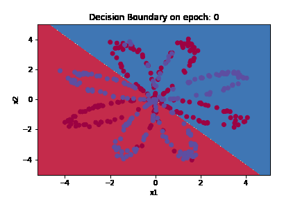
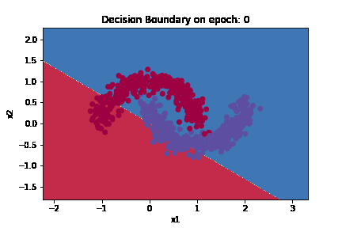
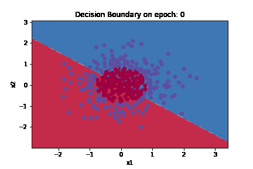

# DeepNeuralNetworkImplementation

Implementing Deep Neural Network from scratch using python.

This is a functional programming approach with numpy.

## Initialization
Weights are inititialized using an adjusted Xavier Initialization

## Visualization
You can visualize the model's output on a (2D) dataset using ```plot_decision_boundary``` function.
> I did not implement this function, but took it from Andrew Ng's Deep Learning Specialization which I took.

## Evaluation
<p align="center">



</p>

## License
[MIT](https://choosealicense.com/licenses/mit/)
